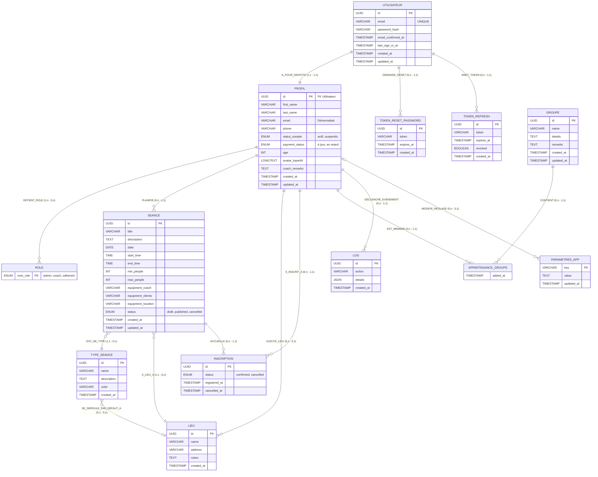

# 📊 Modèle Conceptuel de Données (MCD) — Méthode Merise

L'application **AGHeal** repose sur un modèle de données relationnel complexe. Ce document présente le Modèle Conceptuel de Données (MCD) complet et exhaustif, incluant toutes les entités, propriétés et associations telles qu'elles sont définies dans la base de données réelle.

## 1. Diagramme MCD Global

Voici la représentation visuelle complète du MCD utilisant la syntaxe Entity-Relationship (ER) :

---

## 2. Dictionnaire des Entités et Attributs Détaillés

### 2.1. Pôle Authentification

**Entité : UTILISATEUR (users)**
Gère l'accès sécurisé à la plateforme.
- `id` : Identifiant universel (UUID).
- `email` : Adresse e-mail (clé alternative, unique).
- `password_hash` : Empreinte de sécurité (Algorithme Bcrypt).
- `last_sign_in_at` : Date de la dernière connexion réussie.

**Entité : TOKEN_REFRESH (refresh_tokens)** & **TOKEN_RESET_PASSWORD**
Gèrent la persistance des sessions (Refresh Token JWT) et la récupération de mot de passe.
- `token` : Chaîne cryptographique générée aléatoirement.
- `expires_at` : Limite de validité temporelle.
- `revoked` : (Refresh) Boolean indiquant si le token a été révoqué manuellement (déconnexion).

**Entité : ROLE (user_roles)**
Définit les permissions (Contrôle d'accès basé sur les rôles - RBAC).
- `nom_role` : Liste finie (admin, coach, adherent).

### 2.2. Pôle Profil & Identité

**Entité : PROFIL (profiles)**
Contient les informations signalétiques de l'utilisateur. **Partage la même clé primaire que UTILISATEUR (relation 1:1 stricte).**
- `first_name` & `last_name` : Identité civile.
- `statut_compte` : État global de l'utilisateur (actif, suspendu).
- `payment_status` : Suivi sommaire de la cotisation (à jour, en retard).
- `coach_remarks` : Espace privé réservé aux notes du coach sur un adhérent.
- `avatar_base64` : Image de profil encodée (limitée en taille).

### 2.3. Pôle Séances (Cœur de métier)

**Entité : SEANCE (sessions)**
Événement planifié par un coach.
- `title` & `description` : Informations affichées aux adhérents.
- `date`, `start_time`, `end_time` : Plage horaire stricte.
- `min_people`, `max_people` : Seuils d'ouverture et capacité d'accueil.
- `equipment_coach`, `equipment_clients`, `equipment_location` : Listes textuelles du matériel requis pour la logistique.
- `status` : Cycle de vie (draft = brouillon, published = visible, cancelled = annulée).

**Entité : TYPE_SEANCE (session_types)**
Modèle ou catégorie d'activité (Ex: Pilates, HIIT).
- `name` : Nom de l'activité.
- `color` : Code couleur hexadécimal pour l'affichage dans le calendrier frontend.

**Entité : LIEU (locations)**
Lieu physique où se déroule l'activité.
- `name`, `address`, `notes` : Détails logistiques.

**Entité : INSCRIPTION (registrations)**
Concrétise la participation d'un adhérent à une séance. C'est la résolution de la relation N:M entre Profils et Séances.
- `status` : État de la réservation (confirmed, cancelled).
- `registered_at`, `cancelled_at` : Horodatages permettant des statistiques et des listes d'attente.

### 2.4. Pôle Organisationnel

**Entité : GROUPE (groups)** & **APPARTENANCE_GROUPE (user_groups)**
Permet de regrouper les adhérents (ex: "Groupe Mardi 18h", "Niveau Avancé").
- `remarks` : Notes internes.
- L'appartenance conserve la date d'ajout (`added_at`).

### 2.5. Pôle Système métier

**Entité : PARAMETRES_APP (app_info)**
Données clés/valeur éditables (ex: Message d'accueil, Liens réseaux sociaux, Tarifs).
- `key` : Identifiant texte unique (ex: "contact_email").
- `value` : Contenu riche (HTML ou texte long).

**Entité : LOG (logs)**
Registre d'audit pour tracer les actions sensibles.
- `action` : Nom de l'action (ex: 'login_failed', 'session_cancelled').
- `details` : Format JSON contenant le contexte (IP partiel, modifications de champs).
