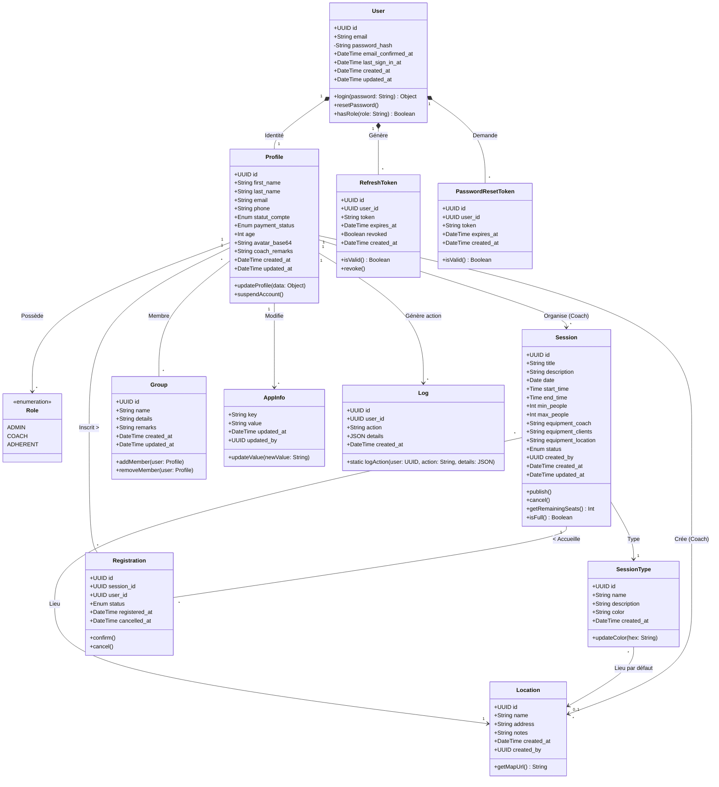

# 🏛️ Diagramme de Classes UML détaillé

Ce document présente l'architecture orientée objet sous-jacente à l'application **AGHeal**. Il traduit le modèle relationnel de la base de données en classes, incluant leurs attributs complets (avec types de données) et leurs méthodes métiers (déduites des contrôleurs PHP).

## 1. Diagramme de Classes Complet

---

## 2. Description des Patterns et Comportements (POO)

### Pattern d'Identité (User & Profile)
Le système sépare strictement l'authentification (classe `User`) des données métier et personnelles (classe `Profile`). 
- **Sécurité** : La classe `User` masque le `password_hash` (`-` private shortcut) et gère les tokens.
- **Métier** : La classe `Profile` centralise les relations avec le reste de l'application (Sessions, Groupes, Inscriptions).

### Cycle de vie d'une séance (Session)
La classe `Session` possède des méthodes d'état modifiant l'attribut `status` (`draft`, `published`, `cancelled`). Elle délègue le typage à `SessionType` et la logistique à `Location`. 
- Ses attributs de capacité (`min_people`, `max_people`) interagissent avec le nombre d'instances de la classe de liaison `Registration`.

### Journalisation (Log)
La classe `Log` est conçue pour être instanciée statiquement (`+static logAction()`) depuis divers contrôleurs (Auth, Profil, Admin) afin d'assurer l'audit et la traçabilité des modifications dans `AppInfo` ou les statuts des utilisateurs.

### Types de Données Spécifiques
- L'utilisation de `UUID` pour la majorité des identifiants (au lieu d'entiers auto-incrémentés) rend les objets intrinsèquement uniques avant même leur persistance en base de données, ce qui facilite la conception d'API REST asynchrones.
- Les champs comme `details` (dans `Log`) utilisent le type `JSON`, offrant une flexibilité non structurée au sein d'un modèle par ailleurs strictement typé.
