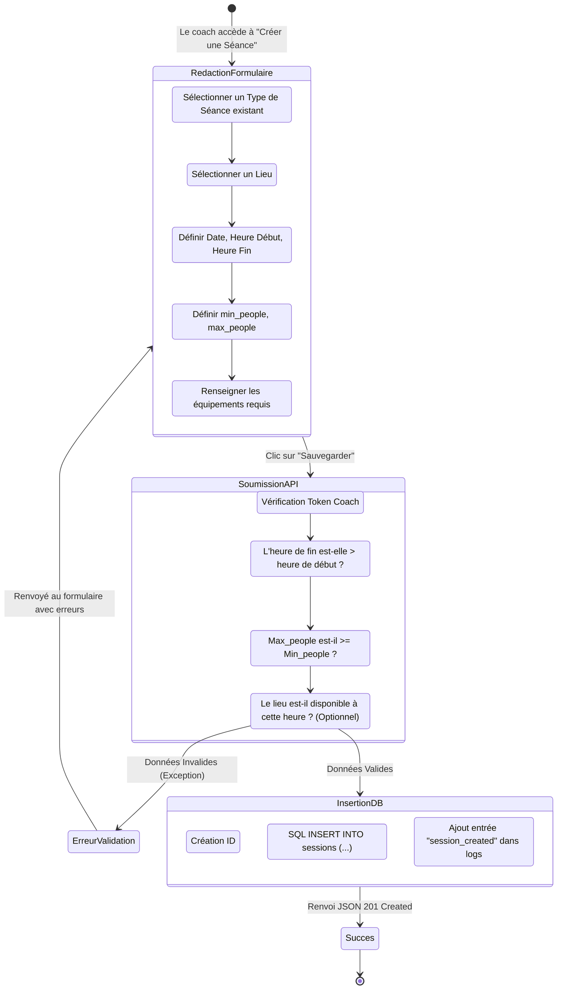
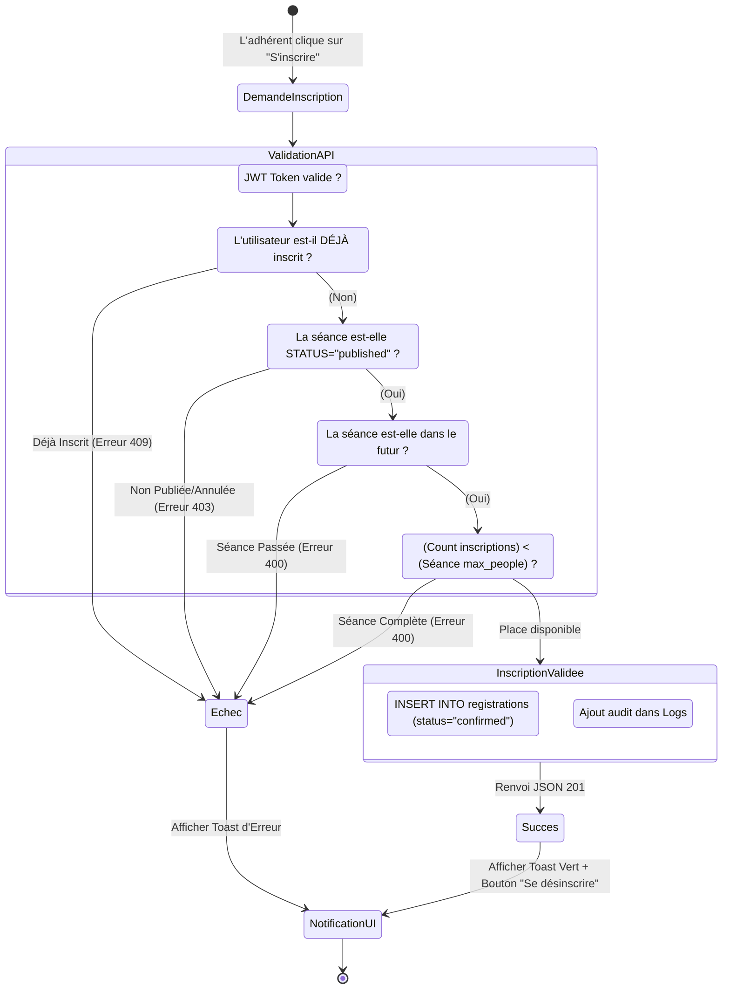
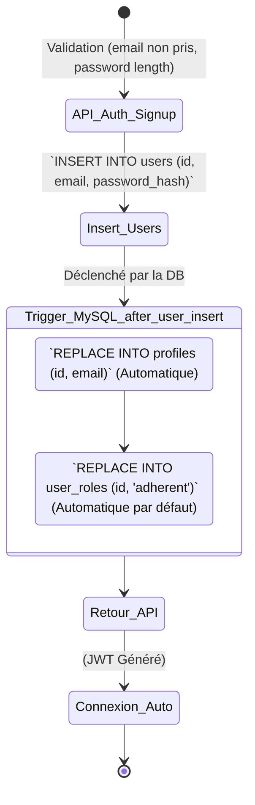

# 🎯 Diagrammes UML : Cas d'Utilisation & Activités

Ce document définit de manière exhaustive les interactions possibles entre les acteurs du système **AGHeal** et détaille les flux logiques complets pour les opérations critiques de l'application.

---

## 1. Diagramme de Cas d'Utilisation (Use Case)

Le diagramme suivant répertorie **tous** les cas d'utilisation prévus par l'application, classés par domaine fonctionnel et selon les droits d'accès des trois rôles (`Adhérent`, `Coach`, `Admin`).

```mermaid
useCaseDiagram
    %% Acteurs avec héritage
    actor "Adhérent" as adherent
    actor "Coach" as coach
    actor "Administrateur" as admin

    admin --|> coach
    coach --|> adherent

    %% Frontière du système
    package "Application AGHeal (Core)" {
        
        %% Authentification & Compte
        package "Authentification & Identité" {
            usecase "S'inscrire / S'identifier" as auth
            usecase "Mettre à jour son profil" as update_profil
            usecase "Réinitialiser mot de passe" as pwd_reset
        }

        %% Actions Adhérent
        package "Espace Séances (Adhérent)" {
            usecase "Consulter les séances (Calendrier)" as vue_seances
            usecase "S'inscrire à une séance (min/max people)" as inscrire
            usecase "Annuler une inscription" as desinscrire
            usecase "Voir ses inscriptions passées/futures" as historique
        }

        %% Actions Coach
        package "Gestion Métier (Coach)" {
            usecase "Créer/Modifier un Type de Séance" as type_seance
            usecase "Créer/Modifier un Lieu" as gestion_lieux
            usecase "Créer/Planifier une Séance (Date/Heure)" as creation_seance
            usecase "Annuler/Modifier une Séance" as modif_seance
            usecase "Voir la liste des inscrits" as liste_inscrits
            usecase "Ajouter de l'équipement requis" as equipment
            usecase "Ajouter une note 'remarque' sur un profil" as notes_coach
        }

        %% Actions Administration
        package "Supervision & Cœur Système (Admin)" {
            usecase "Gérer les Rôles Utilisateurs" as role_admin
            usecase "Suspendre un Compte" as suspend
            usecase "Gérer les Paramètres Globaux (AppInfo)" as param_app
            usecase "Gérer les Groupes d'Abonnés" as groupes
            usecase "Consulter les Logs Système" as vue_logs
        }
    }

    %% Associations Adhérent
    adherent --> auth
    adherent --> pwd_reset
    adherent --> update_profil
    adherent --> vue_seances
    adherent --> inscrire
    adherent --> desinscrire
    adherent --> historique

    %% Associations Coach (hérite tout de l'adhérent via la flèche d'héritage d'acteur)
    coach --> type_seance
    coach --> gestion_lieux
    coach --> creation_seance
    coach --> modif_seance
    coach --> liste_inscrits
    coach --> equipment
    coach --> notes_coach

    %% Associations Admin (hérite tout du coach)
    admin --> param_app
    admin --> role_admin
    admin --> suspend
    admin --> vue_logs
    admin --> groupes

    %% Dépendances logiques (INCLUDES)
    inscrire ..> auth : <<include>>
    creation_seance ..> type_seance : <<include>>
```

---

## 2. Diagrammes d'Activités (Activity Diagrams)

Ces diagrammes décrivent l'algorithmique réelle implémentée dans les contrôleurs de l'application (API PHP) lors des processus complexes.

### 2.1. Processus de Création d'une Séance (Flux Coach)

Ce diagramme illustre le flux permettant à un coach de planifier une nouvelle activité sportive.



### 2.2. Processus d'Inscription à une Séance (Flux Adhérent)

Ce diagramme décrit la validation complexe côté API pour s'assurer qu'un utilisateur peut légitimement s'inscrire à un événement.



### 2.3. Trigger Base de Données : Inscription Nouvel Utilisateur

Le système repose sur un mécanisme automatisé au niveau de MySQL. Voici logiquement ce qu'il se passe lors d'un "Sign Up".


