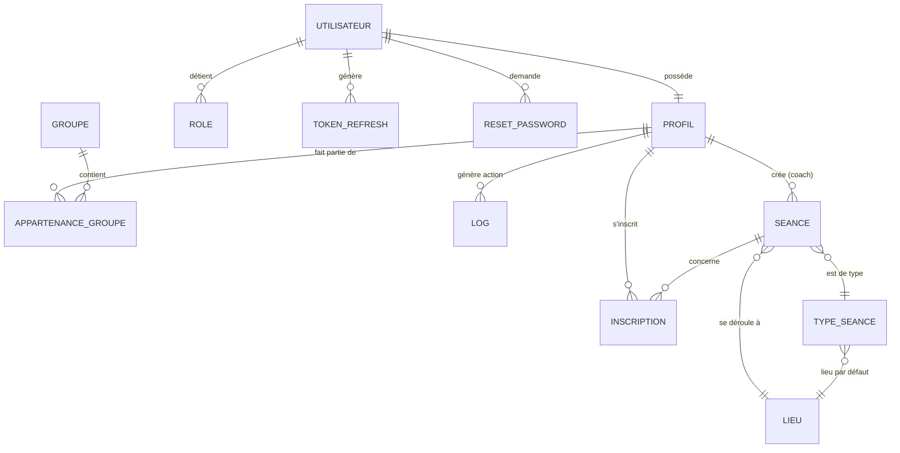

# 📊 Modélisation de Données AGHeal (Merise)

Ce document présente la conception de la base de données AGHeal suivant la méthode Merise.

## 1. Modèle Conceptuel de Données (MCD)

Le MCD représente les entités et leurs relations de manière sémantique.

### Entités principales :
- **Utilisateur** : Identifiants de connexion (Email, Hash).
- **Profil** : Données personnelles et administratives.
- **Séance** : Événement sportif planifié.
- **Lieu** : Localisation physique des séances.
- **Type de séance** : Modèle d'activité (Pilates, Circuit Training, etc.).
- **Groupe** : Regroupement d'adhérents pour le suivi.

---

## 2. Modèle Physique de Données (MPD)

Le MPD est la traduction technique prête pour MySQL.

### Table : `users`
| Colonne | Type | Propriétés | Description |
|---|---|---|---|
| `id` | UUID | PK, NOT NULL | Identifiant unique (lié à profiles.id) |
| `email` | VARCHAR(255) | UNIQUE, NOT NULL | Email de connexion |
| `password_hash` | VARCHAR(255) | NOT NULL | Hash Bcrypt du mot de passe |
| `created_at` | TIMESTAMP | DEFAULT CURRENT_TIMESTAMP | Date de création |

### Table : `profiles`
| Colonne | Type | Propriétés | Description |
|---|---|---|---|
| `id` | UUID | PK, FK (users.id) | Même ID que la table users |
| `first_name` | VARCHAR(100) | | Prénom |
| `last_name` | VARCHAR(100) | | Nom |
| `phone` | VARCHAR(20) | | Téléphone |
| `statut_compte` | ENUM | 'actif', 'suspendu' | État du compte |
| `payment_status` | ENUM | 'à jour', 'en retard' | État des paiements |

### Table : `sessions`
| Colonne | Type | Propriétés | Description |
|---|---|---|---|
| `id` | UUID | PK | Identifiant de la séance |
| `title` | VARCHAR(255) | NOT NULL | Titre de la séance |
| `date` | DATE | NOT NULL | Date |
| `start_time` | TIME | NOT NULL | Heure de début |
| `end_time` | TIME | NOT NULL | Heure de fin |
| `type_id` | UUID | FK (session_types.id) | Lien vers le type d'activité |
| `location_id` | UUID | FK (locations.id) | Lien vers le lieu |
| `created_by` | UUID | FK (profiles.id) | Coach ayant créé la séance |
| `status` | ENUM | 'draft', 'published', 'cancelled' | État de la séance |

### Table : `user_roles`
| Colonne | Type | Propriétés | Description |
|---|---|---|---|
| `user_id` | UUID | PK, FK (users.id) | Lien utilisateur |
| `role` | ENUM | PK, 'admin', 'coach', 'adherent' | Rôle attribué |

### Table : `registrations`
| Colonne | Type | Propriétés | Description |
|---|---|---|---|
| `id` | UUID | PK | Identifiant inscription |
| `session_id` | UUID | FK (sessions.id) | Lien séance |
| `user_id` | UUID | FK (profiles.id) | Lien adhérent |
| `registered_at`| TIMESTAMP | | Date d'inscription |

---

## 🔑 Règles de Gestion
- **PK (Primary Key)** : Chaque table possède un `id` unique (souvent de type UUID).
- **FK (Foreign Key)** : Les relations sont maintenues par des clés étrangères (ex: `type_id` dans `sessions` pointe vers `id` dans `session_types`).
- **Cardinalité** :
    - Un utilisateur a **exactement un** profil (1:1).
    - Un utilisateur peut avoir **plusieurs** rôles (1:N).
    - Une séance appartient à **un seul** lieu, mais un lieu peut accueillir **plusieurs** séances (1:N).
    - Un adhérent peut s'inscrire à **plusieurs** séances, et une séance reçoit **plusieurs** adhérents (N:M géré par la table `registrations`).
